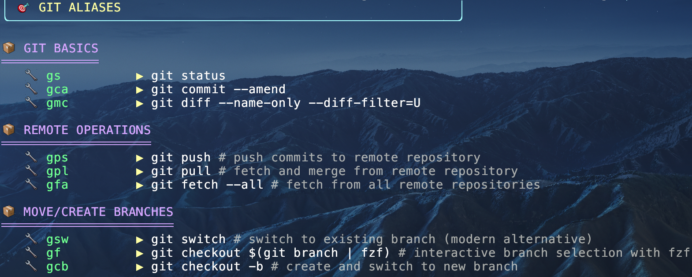
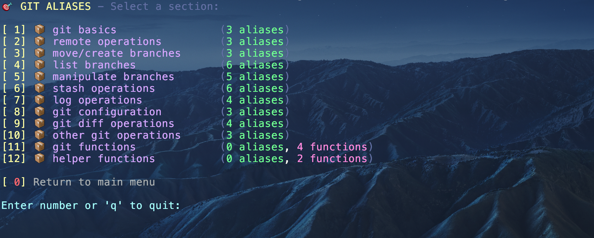

# Repository Walkthrough

## 🎯 Overview
This repository provides a comprehensive shell alias management system with modular organization, enhanced visualization, and cross-platform compatibility. The system is designed for efficient command-line productivity with visual feedback and interactive features.

---

## 📁 Repository Structure

### 🔧 Core System Files

| File | Description |
|------|------------|
| [**README.md**](README.md) | Main documentation with setup instructions, features overview, and usage examples |
| [**source_manager.sh**](source_manager.sh) | Primary entry point that sources all aliases and setup scripts via environment variables |

### 📦 Aliases Directory (`aliases/`)

The heart of the system - modular alias files organized by functionality:

| File | Purpose | Key Features |
|------|---------|-------------|
| [**.aliases**](aliases/.aliases) | 🚦 **Main Router** | Sources all alias files, provides timing utilities, displays loading progress |
| [**.alias_git**](aliases/.alias_git) | 🐙 **Git Operations** | Comprehensive git aliases for basic operations, branching, remote management, stashing, logging, and interactive functions |
| [**.alias_dock**](aliases/.alias_dock) | 🐳 **Docker Management** | Docker container operations, image management, compose commands, and cleanup utilities |
| [**.alias_kube**](aliases/.alias_kube) | ☸️ **Kubernetes Control** | kubectl shortcuts, pod management, service operations, and cluster navigation |
| [**.alias_pys**](aliases/.alias_pys) | 🐍 **Python Development** | Python environment management, pip utilities, conda operations, and virtual environment shortcuts |
| [**.alias_util**](aliases/.alias_util) | 🛠️ **General Utilities** | System shortcuts, navigation helpers, file operations, and custom productivity functions |
| [**.alias_fzf**](aliases/.alias_fzf) | 🔍 **Fuzzy Finding** | fzf integration for enhanced command-line search and selection capabilities |
| [**.alias_oss**](aliases/.alias_oss) | 💻 **OS-Specific** | Platform-specific aliases and configurations (macOS/Linux adaptations) |

### 🤖 Scripts Directory (`scripts/`)

Automation and enhancement tools:

| File | Purpose | Features |
|------|---------|----------|
| [**show.py**](scripts/show.py) | 🎨 **Enhanced Alias Viewer** | Python-based colorized alias display with multiple view modes (cards, table, interactive), section parsing, and visual enhancements |
| [**setup_anaconda.sh**](scripts/setup_anaconda.sh) | 🐍 **Conda Integration** | Anaconda/Miniconda initialization, PATH configuration, and environment setup |
| [**setup_p10k.sh**](scripts/setup_p10k.sh) | ✨ **Shell Theming** | Powerlevel10k prompt configuration, instant prompt setup, and shell customization |
| [**my_installer.sh**](scripts/my_installer.sh) | 📥 **Package Manager** | Automated tool installation, dependency checking, and system setup utilities |

### 📚 Archive Directory (`archive/`)

Legacy and cross-platform configurations

---

## ✨ Display Features

### 🔅 Display Modes
- **Cards View** (default): Grouped sections with icons and colors
- **Table View** (`-t`): Compact tabular format with borders
- **Interactive View** (`-i`): Section selection menu with statistics

---

### 🚀 Usage Examples

```bash
# View git aliases
show git

# Interactive mode
show git -i

# View in table format
show git -t
```

<p align="center">
    
</p>

<p align="center">
    
</p>


*This repository represents a modern approach to shell productivity, combining traditional alias functionality with contemporary visual design and modular architecture.*